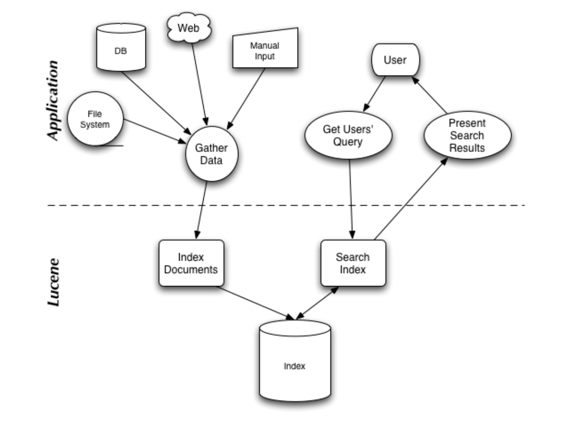

# 初识Lucene

Lucene是一款高性能,可扩展的信息检索(IR)工具库, 专注于**文本索引**和搜索功能.
IR是指文档搜索, 文档内信息搜索或者文档相关的元数据搜索等操作.

Lucene不关心数据源, 只要能把它转换为文本格式即可.

- 建立索引链
  1. 从数据源提取文本信息, 创建文档
  2. 对创建的文档进行索引  
- 基于索引进行搜索

## 索引(Index)

### 原始内容获取

建立索引的前提是需要从不同的数据源获取内容. 
而**内容获取模块**, 在访问规模较大的内容集时, 重要的是能够以**增量**的方式运行, 
每次运行时之访问针对上次运行后内容有所改变的文档.

目前绝大部分的内容获取模块都是通过开源的**爬虫软件**来实现, 例如Solr, Nutch, Grub等

### 建立文档

由于原始内容的来源, 格式千奇百怪, 所以需要在提取后转换为Lucene所能识别的文档格式(文本格式), 
以供搜索引擎使用.

文档主要包括几个域:

- 标题(title)
- 正文(body)
- 摘要(abstract)
- 作者(author)
- 链接(url)
- 自定义域

必须仔细设计如何将原始内容分割成合适的文档和域.

### 文档分析

文档中的文本格式的域还不能用于搜索, 为了进行索引, 需要对文档进行分析处理,
将文档中的文本域分割成一系列语汇单元, 语汇单元是独立的原子元素.

### 创建文档索引

将文档加入到所以索引列表

## 搜索

从索引中查找单词, 然后找到包含该单词的文档.

搜索质量主要由两个维度来衡量:

- 查准率(Precision), 衡量过滤非相关文档的能力
- 查全率(Recall), 衡量查找相关文档的能力

### 建立查询

Lucene提供了查询解析器(QueryParser), 根据通用查询语法将用户输入转化为查询对象(Query).

### 搜索查询

Lucene提供了搜索查询组建, 查询将检索索引并返回与查询语句匹配的文档, 结果返回时按照查询请求来排序.

常见的搜索理论模型:

- 纯布尔模型
- 向量空间模型
- 概率模型

Lucene支持纯布尔模型和向量空间模型.

## 其他组件

- 模块管理
- 分析模块, 分析用户的搜索行为
- 管理界面
- 分析界面
- 搜索范围, 绝大多数的搜索程序都不能在单台机器上完成足够数量的数据搜索或并发搜索

搜索范围有两种界定方式:

- 净处理内容, 将内容分布在多台机器上, 在查询时对多个机器进行查询, 并对收集的结果进行合并
- 净查询吞吐量, 将同一份索引拷贝到不同的机器上

## Lucene的基本使用

基础组件

- Document, 文档
- Field, 文档中的域
- IndexWriter, 主要用于构建文档和生成索引
- IndexReader, 用于和搜索进行交互, 供IndexSearcher使用, 
由于IndexReader的创建开销很大, 往往在搜索使用期间使用同一个IndexReader.
- IndexSearcher, 主要用于搜索IndexWriter生成的索引
- Query
- Term, 搜索的基本单元, 包含一对字符串元素
  + 域名
  + 域文本值
- TopDocs, 用于描述搜索到的文档信息

## Reference

- [Apache Lucene](http://lucene.apache.org/)
- [Lucene实战](https://book.douban.com/subject/6440615/)