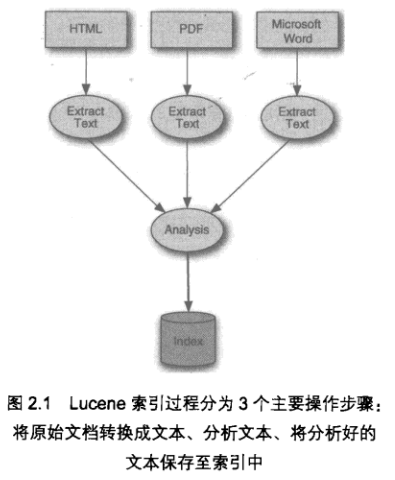

# Lucene Index

索引(Index)是搜索的基础, 所以在搜索之前, 必须先对数据源进行索引.

文档是Lucene索引和搜索的原子单元, 文档中包含1个或多个域(Field), 
域包含了真正被搜索的内容.

Lucene对域提供了3种操作:

- 域值可以被搜索, 如果要搜索一个域, 则必须对域值进行索引
- 域值被索引后, 可以选择性的存储项向量, 用于构建反向索引集合
- 域值可被单独存储

加入到索引的每个文档都是独立的, 与之前加入的文档没有任何关系.

Lucene要求在进行索引操作时对原始数据进行反向规格化(De-normalization).

## 索引过程

1. **提取**原始数据, 构建文档
2. 使用分析器来**分析**文档以及文档中的域, 生成大量语汇单元
3. 将语汇单元**加入到索引**

Lucene将分析结果产生的语汇单元以一种**倒排索引(inverted index)**的数据结构进行存储.
现有所有的web搜索引擎核心都采用的倒排索引技术.

Lucene的索引目录有唯一的一个**段文件(segment)**, 文件名为segments_N, 包含当前所有激活的段.
Lucene会首先打开该文件, 然后打开它所只想的其他文件.

Lucene索引包含一个或多个**段**, 每个段都是一个独立的索引, 它包含整个文档索引的一个子集.
每个段都包含多个文件, 文件格式为**_X.<ext>**, X为段名称, ext对应索引的某个部分, 
各个独立的文件共同组成索引的不同部分.

如果使用混合文件格式, 则索引文件都会被压缩成一个单一的文件**_X.cfs**, 
它能够减少在搜索期间打开的文件数量.

在搜索索引时, 每个段都是单独访问, 最后将搜索结果合并后返回.

## 索引操作

添加文档到索引时, 会需要使用分析器对文档进行分析

Lucene中删除操作不会立即执行, 而是放入内存缓冲区, Lucene会周期性刷新文档目录来执行该操作;
即使删除操作执行了, 存储该文档的磁盘空间也不会立即释放, 而是被标记为"删除", 之后再释放.

可以通过**索引优化optimize**来强制Lucene删除一个文档后合并索引段.

一般通过**etag**来检查文件内容是否发生变化, 然后来决定更新Lucene文档.

Lucene的更新文档是通过先删除, 然后添加新文档的方式来处理的.

优化索引就是将索引的多个段合并成一个或者少量的段.

